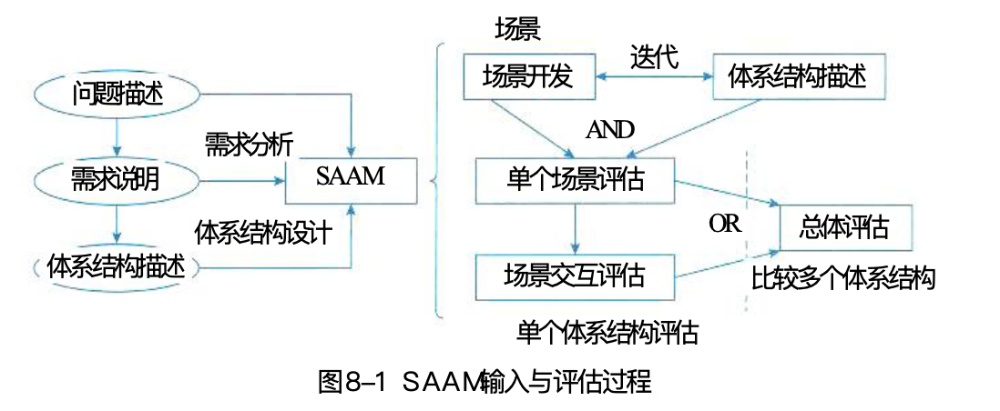
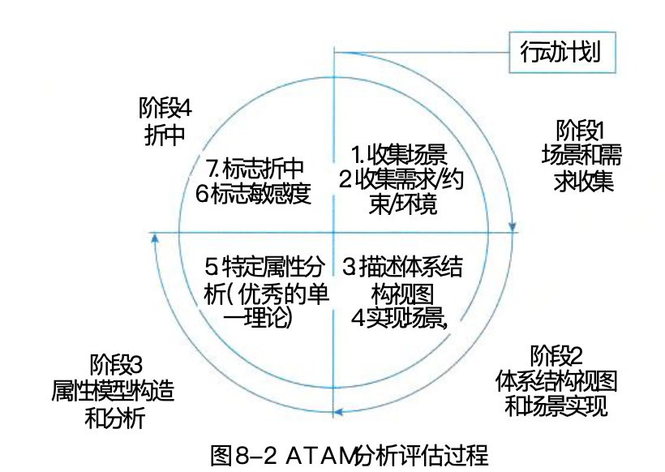

# 系统架构师

## 第一章 绪论

系统架构师是项目开发活动中的关键角色之一。

### 1.1 架构定义

系统架构是系统的一种整体的高层次架构表示，是系统的骨架和根基，决定了系统的健壮性和生命周期的长短。

系统架构对系统以下特性产生重大影响。

* 可靠性
* 安全性
* 可移植性
* 可扩展性
* 可用性
* 可维护性

### 1.2 发展历程

软件架构描述语言

* C2SADL：基于组件和消息的软件架构描述语言
* Wright：分布、并发类型的架构描述语言
* ACME：架构互换语音
* UniCon：基于组件和连接架构描述语言
* Rapide：基于事件架构的描述语言
* 其他Darwin、MetaH、Aesop、Weaves、SADL、xADL

架构分析可分为结构分析、功能分析和非功能分析。分析目的：系统被实际构造之前预测其质量属性。

常见分析方法：

* SAAM: 软件架构分析方法
* ATAM: 架构权衡分析法ATAM
* CBAM: 成本效益分析法
* SBAR: 基于场景的架构再工程
* ALPSM: 架构层次的软件可维护性预测
* SAEM: 软件架构评估模型

架构设计常用方法

* artifact-driven: 从工件描述中提取架构描述的工件驱动
* use-case-driven: 从用例导出架构抽象的用例驱动
* pattern-driven: 从模式导出架构抽象的模式驱动
* domain-driven: 从领域模型导出架构抽象的域驱动
* attribute-driven design: 从设计过程获得架构质量属性需求的属性驱动设计

通常软件开发模型分为三种

* 瀑布模型：软件需求完全确认
* 渐进式开发模型：软件开发初期，只能提供基本需求
* 变换模型：以形式化开发方法为基础

架构风格分为五类

* 数据流风格
* 调用/返回风格
* 独立组件风格
* 虚拟机风格
* 仓库风格

### 1.3 典型架构

典型架构模型包括

* 分层架构
* 事件驱动架构
* 微核架构
* 微服务架构
* 云架构
* C/S
* B/S
* 管道-过滤器
* PAC
* C2风格

系统架构常用建模方法，根据侧重点不同，将软件架构的模型分为四种：

* 结构模型
* 框架模型
* 动态模型
* 过程模型

4种模型并非完全独立，通过有机的结合才可形成一个完整的模型来刻画软件架构。

4+1视角模型，从5个不同的视角来描述软件架构

1. 逻辑视角
2. 过程视角
3. 物理视角
4. 开发视角
5. 场景视角

### 1.4 未来发展

架构发展可以归纳为模块化编程/面向对象编程、构件技术、面向服务开发技术和云技术。一方面引起了软件开发方法的演变，另一方面引发领域工程相关技术广泛应用。

## 第二章 计算机系统

## 第三章 信息系统

## 第四章 信息安全技术

## 第五章 软件工程

## 第六章 数据库

## 第七章 系统架构设计

## 第八章 系统质量属性与架构评估

软件系统属性包括**功能属性**和**质量属性**。软件架构重点关注的是**质量属性**。

架构的基本需求：满足功能属性的前提下，关注软件系统的质量属性。

质量属性场景：精确、定量地表达系统质量属性。

软件系统架构评估：确定软件系统架构、精确描述质量属性场景后。

### 8.1 质量属性概念

#### 8.1.1 质量属性

影响软件质量的6个维度

1. 功能性：包括适合性、准确性、互操作性、依从性、安全性
2. 可靠性：包括容错性、易恢复性、成熟性
3. 可用性：包括易学性、易理解性、易操作性
4. 效率：包括资源特性、时间特性
5. 维护性：包括可测试性、可修改性、稳定性、易分析性
6. 可移植性：包括适应性、易安装性、一致性、可替换性

质量属性可分为：开发期质量属性、运行期质量属性

##### 开发期质量属性

指软件开发阶段关注的质量属性，主要包括6个方面

1. 易理解性：指设计被开发人员理解的难易程度
2. 可扩展性：软件因适应新需求或需求变化而增加新功能的能力，也称为灵活性
3. 可重用性：指重用软件系统或某一部分的难易程度
4. 可测试性：对软件测试以证明其满足需求规范的难易程度
5. 可维护性：当需要修改缺陷、增加功能、提高质量属性时，识别修改点并实施的难易程度
6. 可移植性：将软件系统从一个运行环境移植到另一个不同的运行环境的难易程度

##### 运行期质量属性

指软件运行阶段关注的质量属性，主要包括7个方面

1. 性能：指软件系统及时提供相应服务的能力
2. 安全性：指软件系统同时兼顾向合法用户提供服务，以及阻止非法授权使用的能力
3. 可伸缩性：指当用户数和数据量增加时，软件系统维持高服务质量的能力
4. 互操作性：指本软件系统与其他软件系统交换数据和互相调用服务的难易程度
5. 可靠性：软件系统在一定时间内持续无故障运行的能力
6. 可用性：指系统在一定时间内正常工作的时间所占比例
7. 鲁棒性：指软件在非正常情况下仍能正常运行的能力，也称为健壮性或容错性

#### 8.1.2 面向架构评估的质量属性

架构评估：评价一个软件系统，或软件系统架构。评估过程中关注的质量属性主要有以下8个方面

1. 性能：指系统响应能力。评估：单位时间内处理的事物数量或某个事物处理所需的时间来定量表示。
2. 可靠性：平均失效等待时间（MTTF）、平均失效间隔时间（MTBF）
   * 容错
   * 健壮性
3. 可用性：两次故障之间的时间长度或出现故障时系统能够恢复正常的速度来表示
4. 安全性：可根据系统可能受到的安全威胁类型来分类
5. 可修改性：通常以某些变更为基准，考察这些变更的代价来衡量。
   * 可维护性
   * 可扩展性
   * 结构重组
   * 可一致性
6. 功能性：系统能完成所期望的工作的能力
7. 可变性：架构经扩充或变更而成为新架构的能力
8. 互操作性：与其他系统或自身环境相互作用。软件架构必须为外部提供可视的功能特性和数据结构提供的精心设计的软件入口。

#### 8.1.3 质量属性场景描述

质量属性场景作为描述质量属性的手段，精确描述软件系统的质量属性。质量属性场景是一种面向特定质量属性的需求，由6部分组成。

1. 刺激源：生成刺激的实体（人、计算机系统或任何其他刺激源）
2. 刺激：当刺激到达系统时需要考虑的条件
3. 环境：在某些条件内发生，如过载、运行或其他情况
4. 制品：某个制品被激励（特地质量属性刺激影响到的系统或系统某部分），可能是整个系统或系统的一部分。
5. 响应：该响应是在激励到达后所采取的行动
6. 响应度量：当响应发生时，应当能够以某种方式对其进行度量，以对需求进行测试。

##### 可用性质量属性场景

|场景要素|可能的情况|
|---|---|
|刺激源|系统内部、系统外部|
|刺激|疏忽、错误、崩溃、时间|
|环境|正常操作、降级模式|
|制品|系统处理器、通信信道、持久存储器、进程|
|响应|系统应该检测事件、并进行如下一个或多个活动；将其记录下来通知适当各方；在一段预先指定的时间内不可用；降级使用|
|响应度量|系统必须可用的时间间隔；可用时间；系统可以在降级模式下运行的时间间隔；故障修复时间|

##### 可修改性质量属性场景

|场景要素|可能的情况|
|---|---|
|刺激源|最终用户、开发人员、系统管理员|
|刺激|希望增加、删除、修改、改变功能、质量属性、容量等|
|环境|系统设计时、编译时、构建时、运行时|
|制品|系统用户界面、平台、环境或与目标系统交互的系统|
|响应|查找架构中需要修改的位置，进行修改且不影响其他功能，对所做的修改进行测试，部署所做的修改|
|响应度量|根据所影响的元素的数量度量的成本、努力、资金；该修改对其他功能或质量属性所造成影响的程度|

##### 性能质量属性场景

|场景要素|可能的情况|
|---|---|
|刺激源|用户请求、其他系统触发等|
|刺激|定期事件到达、随机事件到达、偶然事件到达|
|环境|正常模式、超载模式|
|制品|系统|
|响应|处理刺激、改变服务级别|
|响应度量|等待时间、期限、吞吐量、抖动、缺失率、数据丢失率等|

##### 可测试性质量属性场景

|场景要素|可能的情况|
|---|---|
|刺激源|开发人员、增量开发人员、系统验证人员、客户验收测试人员、系统用户|
|刺激|已完成的分析、架构、设计、类和子系统基础；所交付的系统|
|环境|设计时、开发时、编译时、部署时|
|制品|设计、代码段、完整的引用|
|响应|提供状态只的访问，提供所有计算的值，准备测试环境|
|响应度量|已执行的可执行语句的百分比；如果存在缺陷出现故障的概率；执行测试的时间；测试中最长依赖的长度；准备测试环境的时间|

##### 易用性质量属性场景

|场景要素|可能的情况|
|---|---|
|刺激源|最终用户|
|刺激|学习系统特性、使用系统、使错误的影响最低、适配系统、对系统满意|
|环境|系统运行时或配置时|
|制品|系统|
|响应|系统提供一个或多个想要来支持：学习、使用系统、使错误影响最低、适配系统、对系统满意|
|响应度量|任务时间、错误数量、解决问题的数量、用户满意度、用户知识的获取、成功操作在总操作中所占比例、损失时间/丢失数据量|

##### 安全性质量属性场景

|场景要素|可能的情况|
|---|---|
|刺激源|正确识别、非正常识别身份未知的来自内部/外部的个人或系统；经过授权/未授权它访问了有限的资源/大量资源|
|刺激|试图显示数据，改变/删除数据，访问系统服务，降低系统服务的可用性|
|环境|在线或离线、联网或断网、连接有防火墙或者直接连接到了网络|
|制品|系统服务、系统中的数据|
|响应|对用户身份进行认证；隐藏用户身份；阻止对数据或服务的访问；允许访问数据或服务；授予或收回对访问数据或服务的许可；根据身份记录访问、修改或试图访问、修改数据、服务；以一种不可读的格式存储数据；识别无法解释的对服务的高需求；通知用户或另外一个系统，并限制服务的可用性|
|响应度量|用成功概率表示，避开安全防范措施所需要的时间、努力、资源；检测到攻击的可能性；确定攻击或访问、修改数据或服务的个人的可能性；在拒绝服务攻击的情况下仍然获得服务的百分比；恢复数据、服务；被破坏的数据、服务和（或）被拒绝的合法访问的范围|

### 8.2 系统架构评估

系统架构评估是在对架构分析、评估的基础上，对架构策略的选取进行决策。

系统架构评估的方法有三类：

1. 基于调查问卷或检查表的方式：充分利用系统相关人员的经验和知识，获得对架构的评估。缺点：依赖于评估人员的主观推断。
2. 基于场景的方式：分析软件架构对场景的支持程度，从而判断该架构对这一场景所代表的质量需求的满足程度。
   1. 架构权衡分析法，缩写ATAM
   2. 软件架构分析方法，缩写SAAM
3. 基于度量的方式：建立在架构度量的基础上，
   1. 建立质量属性和度量之间的映射关系
   2. 软件架构稳定中获取度量信息
   3. 映射原则分析推导出系统的质量属性

##### 8.2.1 重要概念

* 敏感点：一个或多个构件的特性。
* 权衡点：影响多个质量属性的特性，是多个质量属性的敏感点。
* 风险承担者：系统架构涉及很多人的利益，这些人对架构施加各种影响，以保证自己的目标能够实现。
* 场景：精确得出具体的质量目标即为场景，以质量目标作为判定架构优劣的标准。通过以下3个方面来对场景进行描述
  * 刺激
  * 环境
  * 响应

###### 系统生产者

|风险承担者|职责|所关心的问题|
|---|---|---|
|软件系统架构师|负责软件架构的质量需求间进行权衡的人|对其他风险承担者提出的质量需求的折中和调停|
|开发人员|设计人员或程序员|架构描述的清晰与完整、各部分的内聚性与受限耦合、清楚的交互机制|
|维护人员|系统初次部署完成后对系统进行更改的人|可维护性，确定出某个更改发生后须对系统中哪些地方进行改动的能力|
|集成人员|负责构件集成和组装的开发人员|与上同|
|测试人员|负责系统测试的开发人员|集成、一致的错误处理协议，受限的构件耦合、构件的高内聚性、概念完整性|
|标准专家|负责锁开发软件必须满足的标准细节的开发人员|对所关心问题的分离、可修改性和互操作性|
|性能工程师|分析系统的工作产品以确定系统是否满足其性能机吞吐量需求的人员|易理解性、概念完整性、性能、可靠性|
|安全专家|负责保证系统满足其安全性需求的人员|安全性|
|项目经理|负责为各小组配置资源、保证开发进度、保证不超出预算的人员，负责与客户沟通|架构层次清晰，便于组建小组；任务划分结构、进度标志和最后期限|
|产品线经理|设想该架构和相关资产怎样在该组织的其他开发中得以重用的人员|可重用性、灵活性|

###### 系统消费者

|风险承担者|职责|所关心的问题|
|---|---|---|
|客户|系统的购买者|开发的进度、总体预算、系统的有用性、满足需求的情况|
|最终用户|所实现系统的使用者|功能性、可用性|
|应用开发者|利用该架构及其他已有可重用构件，通过将其实例化而构建产品的人员|架构的清晰性、完整性、简单交互机制、简单裁剪机制|
|任务专家、任务规划者|知道系统将会怎样使用以实现战略目标的客户代表|功能性、可用性、灵活性|

###### 系统服务人员

|风险承担者|职责|所关心的问题|
|---|---|---|
|系统管理员|负责系统运行的人员|容易找到可能出现问题的地方|
|网络管理员|管理网络的人员|网络性能、可预测性|
|技术支持人员|为系统在该领域中使用和维护提供支持的人员|使用性、可服务性、可裁剪性|

###### 其他人员

|风险承担者|职责|所关心的问题|
|---|---|---|
|领域代表|类似系统或所考察系统将要在其中运行的系统的构建者或拥有者|可互操作性|
|系统设计师|整个系统的架构设计师，负责在软件和硬件之间进行权衡并选择硬件环境的人|可移植性、灵活性、性能和效率|
|设备专家|熟悉该软件必须与之交互的硬件的人员，能够预测硬件技术的未来发展趋势的人员|可维护性、性能|

##### 8.2.2 系统架构评估方法

###### SAAM方法

非功能质量属性的架构分析方法，最早形成文档并得到广泛使用的软件架构分析方法。最初用于比较不同软件体系的架构，以分析系统架构的可修改性。后来实践证明也可以用于其他质量属性，如可移植性、可扩充性等，最终发展成为一个通用的评估系统架构的方法。

1. 特定目标：对描述应用程序属性的文档，验证基本的架构假设和原则。
2. 评估技术：场景技术。
3. 质量属性：把任何形式的质量属性都具体化为场景，可修改性是SAAM分析的主要质量属性。
4. 风险承担者
5. 架构描述：用于架构的最后版本，但早于详细设计
6. 方法活动：主要输入是**问题描述**、**需求声明**、**架构描述**。SAAM分析评估架构过程的5个步骤
   1. 场景开发
   2. 架构描述
   3. 单个场景评估
   4. 场景交互
   5. 总体评估
7. 已有知识库的重用性：SAAM不考虑此问题
8. 方法验证

###### ATAM方法

架构权衡分析方法（ATAM）是在SAAM方法基础上发展起来的，主要对性能、实用性、安全性、可修改性。在系统开发之前，对这些质量属性进行评价和折中。

1. 特定目标：考虑多个相互影响的质量属性，提供一个理解软件架构的能力的方法。
2. 质量属性：
3. 风险承担者
4. 架构描述
5. 评估技术：不同的架构角度，有3种不同的场景
   1. 用例
   2. 增长场景
   3. 探测场景
6. 方法活动
   1. 场景和需求收集
   2. 架构视图和场景实现
   3. 属性模型构造和分析
   4. 折中
7. 领域知识库的可重用性
8. 方法验证

ATAM方法采用效用树来对质量属性进行分类和优先级排序。效用树结构：树根、质量属性、属性分类、质量属性场景。

ATAM主要关注的4类质量属性：性能、安全性、可修改性、可用性。也是利益相关者最关心的。

得到初始效用树后，需要修剪这棵树，保留重要场景。再对重要场景按重要性定优先级，再按照场景实现的难易程度确定优先级。可以得到每个场景的优先级对（重要度、难易度）。优先级都使用H/M/L来表示。

###### CBAM方法

成本效益分析法（CBAM）是在ATAM上构建的，用来对架构设计决策的成本和收益进行建模，是优化此类决策的一种手段。分为8个步骤

1. 整理场景
2. 对场景进行求精
3. 确定场景优先级
4. 分配效用
5. 架构策略设计哪些质量属性及响应级别
6. 使用内插法确定”期望的“质量属性响应级别的效用
7. 计算各加购策略的总收益
8. 根据受成本限制影响的ROI选择架构策略。

###### 其他评估方法

1. SAEM方法
2. SAABNet方法，来源于人工智能
3. SACMM
4. SASAM
5. ALRRA
6. AHP，层次分析法
7. COSMIC+UML方法

## 第九章 软件可靠性基础

