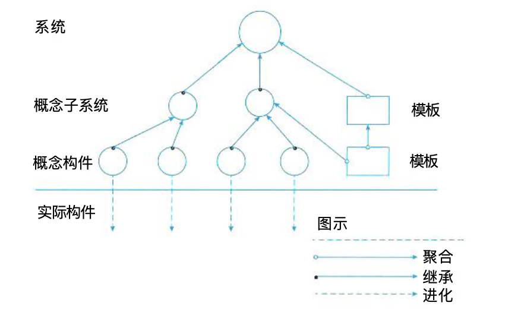
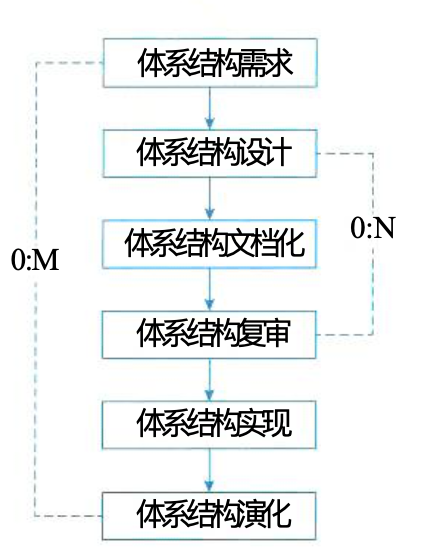
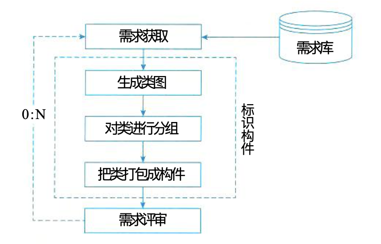
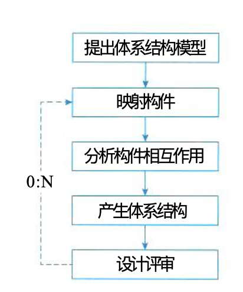
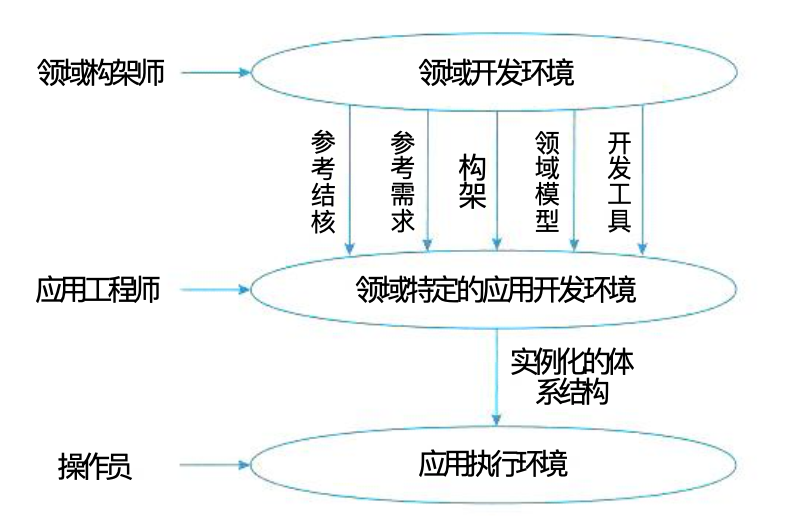

# 系统架构师

## 第一章 绪论

系统架构师是项目开发活动中的关键角色之一。

### 1.1 架构定义

系统架构是系统的一种整体的高层次架构表示，是系统的骨架和根基，决定了系统的健壮性和生命周期的长短。

系统架构对系统以下特性产生重大影响。

* 可靠性
* 安全性
* 可移植性
* 可扩展性
* 可用性
* 可维护性

### 1.2 发展历程

软件架构描述语言

* C2SADL：基于组件和消息的软件架构描述语言
* Wright：分布、并发类型的架构描述语言
* ACME：架构互换语音
* UniCon：基于组件和连接架构描述语言
* Rapide：基于事件架构的描述语言
* 其他Darwin、MetaH、Aesop、Weaves、SADL、xADL

架构分析可分为结构分析、功能分析和非功能分析。分析目的：系统被实际构造之前预测其质量属性。

常见分析方法：

* SAAM: 软件架构分析方法
* ATAM: 架构权衡分析法ATAM
* CBAM: 成本效益分析法
* SBAR: 基于场景的架构再工程
* ALPSM: 架构层次的软件可维护性预测
* SAEM: 软件架构评估模型

架构设计常用方法

* artifact-driven: 从工件描述中提取架构描述的工件驱动
* use-case-driven: 从用例导出架构抽象的用例驱动
* pattern-driven: 从模式导出架构抽象的模式驱动
* domain-driven: 从领域模型导出架构抽象的域驱动
* attribute-driven design: 从设计过程获得架构质量属性需求的属性驱动设计

通常软件开发模型分为三种

* 瀑布模型：软件需求完全确认
* 渐进式开发模型：软件开发初期，只能提供基本需求
* 变换模型：以形式化开发方法为基础

架构风格分为五类

* 数据流风格
* 调用/返回风格
* 独立组件风格
* 虚拟机风格
* 仓库风格

### 1.3 典型架构

典型架构模型包括

* 分层架构
* 事件驱动架构
* 微核架构
* 微服务架构
* 云架构
* C/S
* B/S
* 管道-过滤器
* PAC
* C2风格

系统架构常用建模方法，根据侧重点不同，将软件架构的模型分为四种：

* 结构模型
* 框架模型
* 动态模型
* 过程模型

4种模型并非完全独立，通过有机的结合才可形成一个完整的模型来刻画软件架构。

4+1视角模型，从5个不同的视角来描述软件架构

1. 逻辑视角
2. 过程视角
3. 物理视角
4. 开发视角
5. 场景视角

### 1.4 未来发展

架构发展可以归纳为模块化编程/面向对象编程、构件技术、面向服务开发技术和云技术。一方面引起了软件开发方法的演变，另一方面引发领域工程相关技术广泛应用。

## 第二章 计算机系统

## 第三章 信息系统

## 第四章 信息安全技术

## 第五章 软件工程

软件工程，是参照其他学科将开发软件的过程当成一项工程来实施。就像建房子，先买材料、打地基等等分成一个个步骤，按步骤处理。常见的软件开发阶段划分为需求、分析、设计、编码和测试等环节。在这些环节中，分别介绍其常见方法和技术。

### 5.1 软件工程

#### 软件危机

60年代中期，大容量、高速度计算机的出现，使得计算机应用范围迅速扩大，软件开发急剧增长，软件系统规模越来越大，复杂程度越来越高，软件可靠性问题也越来越突出。由此引出了软件危机概念。

软件危机具体表现：

* 软件开发进度难以预测
* 软件开发成本难以控制
* 软件功能难以满足用户期望
* 软件质量无法保证
* 软件难以维护
* 软件缺少适当的文档资料

为解决软件危机，1968、1969年NATO连续召开2次会议，提出**软件工程**概念。

#### 软件工程定义

很多学者和组织机构给出了自己的软件工程定义：

* Barry Boehm：运用现代科学技术知识来设计并构造计算机程序及为开发、运行和维护这些程序所必须的相关文件资料。
* IEEE：软件工程是1、将系统化、严格约束的、可量化的方法应用于软件的开发、运行和维护；2、对1种所述方法的研究。
* Fritz Bauer：建立并使用完善的工程化原则，以较经济的手段获得能在实际机器上有效运行的可靠软件的一系列方法。
* 《计算机科学技术百科全书》：软件工程是应用计算机科学、数学、逻辑学及管理科学等原理，开发软件的工程。

#### 软件工程过程

软件工程过程是指为获得软件产品，在软件工具的支持下由软件工程师完成的一系列软件工程活动

* P（Plan）—— 软件规格说明
* D（Do）—— 软件开发
* C（Check）—— 软件确认
* A（Action）—— 软件演进

#### 软件过程模型

软件生命周期：描述了软件从生到死的全过程。需求分析、软件设计、软件开发、运行维护，直至被淘汰这样的全过程。

为使软件生命周期中各项任务能够有序地按照规程进行，需要一定的工作模型对各项任务给予规程约束，这个工作模型称为**软件过程模型**，或**软件生命周期模型**。

* 瀑布模型
* 原型化模型
* 螺旋模型
* 敏捷模型
* 统一过程模型（RUP）

#### 瀑布模型

特点：因果关系紧密相连，适用于需求明确
缺点：软件需求完整性、正确性等难以确定，甚至是不可能和不现实的；严格串行化的过程模型，耗时长；每个阶段一次性完成该阶段工作，实际上是不可能的。

#### 原型化模型

有2个阶段：原型化开发和目标软件开发。适用于需求不明确的项目

#### 螺旋模型

在快速原型的基础上扩展来的。将软件开发流程分为多个阶段，每个阶段有4个部分组成：1、目标设定；2、风险分析；3、开发和有效性验证；4、评审。

> 做题时提到风险，就应该想到螺旋模型。

#### 敏捷模型

敏捷编程的特点

* 是“适应性”的，而非“预设性”。敏捷适应变化，目的就是称为适应变化的过程。
* 是“面向人的”，而非“面向过程的”。试图使软件开发工作能够充分发挥人的创造能力。

核心思想

* 是适应型，而非可预测型
* 是以人为本，而非以过程为本
* 迭代增量式的开发过程，以原型开发思想为基础，采用迭代增量式开发，发行版本小型化。

##### 敏捷编程方法介绍

* 极限编程：加强交流、从简单做起、寻求反馈、勇于实事求是
* 水晶系列方法
* Scrum：侧重项目管理
* 特征驱动开发方法（FDD）
  * 3个要素：人、过程和技术。
  * 6个角色：项目经理、首席架构设计师、开发经理、主程序员、程序员和领域专家。
  * 5个核心过程：开发整体对象模型、构造特征列表、计划特征开发、特征设计和特征构建。

#### 统一过程模型（RUP）

RUP是Rational软件公司创造的软件工程方法。描述了如何有效地利用商业的、可靠的方法开发和部署软件，是一种重量级过程。

##### RUP的生命周期

是一个二维的软件开发模型，RUP有9个核心工作流，如下：

* 业务建模
* 需求
* 分析与设计
* 实现
* 测试
* 部署
* 配置与变更管理
* 项目管理
* 环境

RUP将开发周期划分为多个循环，每个循环生成产品的一个新的版本。每个循环依次由4个连续的阶段组成，4个阶段如下：

* 初始阶段
* 细化阶段
* 构造阶段
* 移交阶段

RUP中的核心概念

* 角色
* 活动
* 制品
* 工作流

RUP的特点：用例驱动、以体系结构为中心的、迭代和增量的软件开发过程。

#### 软件能力成熟度模型

CMMI

1. Level1 初始级
2. Level2 已管理级
3. Level3 已定义级
4. Level4 量化管理级
5. Level5 优化级

### 5.2 需求工程

软件需求包括以下内容：

1. 用户解决问题或达到目标所需条件或权能
2. 系统或系统部件要满足合同、标准、规范或其他正式规定文档所需具有的条件或权能
3. 一种反应上面1和2所述条件或权能的文档说明

包括三个不同的层次：业务需求、用户需求、功能需求（也包括非功能需求）

## 第六章 数据库

## 第七章 系统架构设计

### 7.1 软件架构概念

#### 7.1.1 软件架构定义

SA：Software Architecture

定义：一个程序和计算机系统软件体系结构是指系统的一个或多个结构。结构中包括软件的构件，构件的外部可见属性以及它们之间的相互关系。

体系结构不是可运行的软件，是一种表达，使工程师能够：

1. 分析设计在满足所规定的需求方面的有效性
2. 在设计变更相对容易的阶段，考虑体系结构可能的选择方案
3. 降低与软件构造相关联的风险

软件构件，可以使程序模块、面向对象的类、数据库、实现客户与服务器网络配置的“中间件”

软件体系结构的设计通常考虑2个方面

* 数据设计：体现传统系统中体系结构的数据构件和面向对象系统中类的定义
* 体系结构设计：关注软件构件的结构、属性和交互作用

#### 7.1.2 软件架构设计与生命周期

##### 需求分析阶段

* 需求分析：问题空间
* SA设计：解空间

需求模型 -> SA模型，关注2个问题

1. 如何根据需求模型构建SA模型
2. 如何保证模型转换的可追踪性

##### 设计阶段

主要研究：SA模型描述、SA模型的设计与分析方法、SA设计经验的总结与复用

* SA的概念：SA由哪些元素组成、怎么组织
* 体系结构描述语言：UniCon、Rapide、Darwin、Wright、C2 SADL、Acme、xADL、XYZ/ADL、ABC/ADL
* 多视图，体现了关注点分离的思想

4+1模型：逻辑视图、进程视图、开发视图、物理视图、统一的场景

4视图：概念视图、模块视图、执行视图、代码视图

Views and Beyond模型：模块视图、构件和连接子视图、分配视图

##### 实现阶段

SA研究以下方面

1. 基于SA的开发过程支持
2. 寻求从SA向实现过度的途径
3. 基于SA的测试技术

##### 构件组装阶段

SA研究两个方面

1. 如何支持可复用构件的互联
2. 组装过程中，如何检测并消除体系结构失配问题

中间件支持的连接子实现有如下优势：

1. 提供了构件之间跨平台交互的能力，且遵循特定的工业标准，可以有效地保证构件之间的通信完整性
2. 产品化中间件可以提供强大的公共服务能力，更好地保证最终系统的质量属性

> 新的SA风格：中间件导向的体系结构风格

检测并消除体系结构失配。失配指软件复用过程中，待复用构件对最终系统的体系结构和环境假设与实际状况不同而导致的冲突。

失配问题体现在3个方面：

* 由构件引起的失配
* 由连接子引起的失配
* 由系统成分对全局体系结构的假设存在冲突引起的失配

##### 部署阶段

SA对软件部署作用：

1. 提供高层的体系结构视图来描述部署阶段的软硬件模型
2. 基于SA模型可以分析部署方案的质量属性，从而选择合理的部署方案

##### 后开发阶段

SA研究主要围绕维护、演化、复用等方面。

#### 7.1.3 软件架构的重要性

软件架构是降低成本、改进质量、按时和按需交付产品的关键因素。

1. 能够满足系统的品质。架构设计文档化，可以尽早地评估项目的这些品质
2. 使受益人达成一致的目标
3. 能够支持计划编制过程
4. 对系统开发的指导性
5. 能够有效地管理复杂性
6. 为复用奠定了基础
7. 能够降低维护费用
8. 能够支持冲突分析

### 7.2 基于架构的开发方法

#### 7.2.1 概述

基于体系结构的软件设计（ABSD）方法，由构成体系结构的**商业**、**质量**和**功能需求**的组合驱动。

设计活动可以在项目总体功能框架明确就开始，需求抽取和分析还没有完成，就开始了软件设计。

3个基础

1. 功能的分解
2. 通过选择体系结构风格来实现质量和商业需求
3. 软件模板的使用

#### 7.2.2 概念和术语

ABSD方法是自顶向下、递归细化的方法，软件系统的体系结构通过该方法得到细化，直到能产生软件构件和类。

考虑体系结构时，需要从不同的视角来观察对架构的描述。

* 静态视角：展示功能组织的静态视角能判断质量特性
* 动态视角：展示并发行为的动态视角能判断系统行为特性

使用用例捕获功能需求，定义特定场景来捕获质量需求，并称这些场景为质量场景。

#### 7.2.3 基于体系结构的开发模型

传统开发模型：软件体系结构的建立应位于需求分析之后，概要设计之前。

ABSD模型把整个基于体系结构的软件过程划分为体系结构需求、设计、文档化、复审、实现和演化6个子过程。

#### 7.2.4 体系结构需求

##### 需求获取

来自3个方面

* 系统的质量目标
* 系统的商业目标
* 系统开发人员的商业目标

需求获取过程主要是定义开发人员必须实现的软件功能，使得用户能完成他们的任务，从而满足业务上的功能需求。还能获得软件质量属性，满足一些非功能需求。

##### 标识构件

3步来实现标识构件

1. 生成类图
2. 对类进行分组
3. 把类打包成构件

##### 架构需求评审

组织一个由不同代表（如分析人员、客户、设计人员和测试人员）组成的小组，对体系结构需求及相关构件进行自习的审查。

审查内容

1. 获取的需求是否真实地反应了用户需求
2. 类的分组是否合理
3. 构件合并是否合理

必要时，可以在“需求获取-标识构件-需求评审”进行迭代。

#### 7.2.5 体系结构设计

体系结构设计的步骤

1. 提出软件体系结构模型
2. 把已标识的构件映射到软件体系结构中
3. 分析构件之间的相互作用
4. 产生软件体系结构
5. 设计评审

#### 7.2.6 体系结构文档化

主要输出2个文档

* 体系结构规格说明书
* 测试体系结构需求的质量设计说明书

文档是从使用者角度编写，必须分发给所有与系统有关的开发人员，且必须保证开发者手上的文档是最新的。

#### 7.2.7 体系结构复审

由体系结构的开发模型可以知道，体系结构设计、文档化、复审是一个迭代过程。

主版本的软件体系结构分析后，要安排一次外部人员（用户代表和领域专家）参加复审。

复审目的：标识潜在的风险，及早发现体系结构设计中的缺陷和错误，包括体系结构能否满足需求、质量需求是否在设计中得到体现、层次是否清晰、构件的划分是否合理、文档表达是否明确、构件的设计是否满足功能与性能的要求等。

#### 7.2.8 体系结构实现

实现过程是以复审后的文档化的体系结构说明书为基础。

实现过程

1. 复审后的文档化的体系结构
2. 分析与设计
3. 构件实现
4. 构件组装
5. 系统测试
6. 体系结构演化

#### 7.2.9 体系结构演化

使用系统演化步骤去修改应用，以满足新的需求。包括6个步骤

1. 需求变化归类
2. 制定体系结构演化计划
3. 修改、增加或删除构件
4. 更新构件的相互作用
5. 构件组装与测试
6. 技术评审

### 7.3 软件架构风格

软件体系结构设计的核心目标：重复的体系结构模式，即达到体系结构级的软件复用。

软件体系风格是描述某一特定应用领域中系统组织方式的惯用模式。

体系结构风格定义了一个系统家族，即一个体系结构定义一个词汇表和一组约束。

* 词汇表：包含一些构件和连接件类型
* 一组约束：系统是如何将这些构件和连接件组合起来的。

体系结构风格反映了领域中众多系统所共有的结构和语义特征，并指导如何将各个模块和子系统有效地组织完成一个完整的系统。

#### 数据流体系结构风格

主要包括：**批处理风格**和**管道-过滤器风格**。

批处理风格，每个处理步骤都是单独的程序，每一步都必须在前一步结束后才能开始，而且数据必须是完整的，以整体的方式传递。

管道-过滤器风格，系统分成了几个序贯的处理步骤，一个步骤的输出是另一个步骤的输入。

#### 调用/返回体系结构风格

主要包括：主程序/子程序风格、面向对象风格、层次型风格、客户端/服务器风格。

主程序/子程序风格，一般采用单线程控制，把问题划分为若干处理步骤。

面向对象体系结构风格，建立在数据抽象和面向对象基础上，数据的表示方法和它们相应操作封装在一个抽象数据类型或对象中。

层次型体系结构风格，每一层为上层提供服务，并作为下层的客户。每一层最多影响两层，同时只要给相邻层提供相同接口，允许每层用不同的方法实现，为软件重用提供了强大的支持。

客户端/服务端体系结构风格

* 两层C/S体系结构有3个主要组成部分：数据库服务、客户端应用程序和网络。称为“胖客户端，瘦服务器”
* 三层C/S结构，增肌阿勒一个应用服务器，应用逻辑在应用服务器上，只有表示层在客户机上，故称为“瘦客户机”。应用功能分为表示层、功能层、数据层。

#### 以数据为中心的体系结构风格

主要包括：仓库体系结构风格、黑板体系结构风格

仓库风格：仓库是存储和维护数据的中心场所。两种构件：中央数据结构说明当前数据的状态、一组对中央数据进行操作的独立构件。

黑板风格：适用于解决复杂的非结构化的问题，能在求解的过程中综合运用多种不同知识源、使得问题的表达、组织和求解变得比较容易。

黑板系统是一种问题求解模型，是组织推理步骤、控制状态数据和问题求解之领域知识的概念框架。

黑板风格传统应用是信号处理领域，如语音识别、模式识别。另一应用是松耦合代理数据共享存取。

#### 虚拟机体系结构风格

基本思想：人为构件一个运行环境，在这个环境上可以解析和运行自定哦的一些语音，增加框架的灵活性。

主要包括解释器风格和规则系统风格。

解释器风格：一个解释器通常包括完成解释工作的解释引擎、一个包含将被解释的代码的存储区，一个记录解释引擎当前工作状态的数据结构，以及一个记录源代码被解释执行进度的数据结构。典型例子：专家系统。

规则系统风格：包括规则集、规则解释器、规则/数据选择器及工作内存。

#### 独立构件体系结构风格

强调系统中的每个构件都是相对独立的个体，不直接通信以降低耦合度、提升灵活性。主要包括进程通信和事件系统风格。

进程通信：连接件是消息传递，消息传递的方式可以点到点、异步或同步以及远程过程调用。

事件风格：隐式调用风格的思想。构件不直接调用一个过程，而是触发或广播一个或多个事件。

基于事件的隐式调用风格的特点：事件的触发者并不知道哪些构件会被这些事件影响。

### 7.4 软件架构复用

软件复用是指系统化的软件开发过程：开发一组基本的软件构造模块，以覆盖不同的需求/体系结构之间的相似性，从而提高系统开发的效率、质量和性能。

软件架构的复用类型包括**机会复用**和**系统复用**。

* 机会复用：指开发过程中，只要发现有可复用的资产，就对其进行复用。
* 系统复用：指在开发之前，就要进行规划，以决定哪些需要服用。

软件复用的优点：

* 减少开发工作
* 减少开发时间
* 降低开发成本，提高生产力
* 提高产品质量，使其有更好的互操作性
* 使产品维护更简单

可复用的资产非常广，可以包括以下方面

1. 需求
2. 架构设计
3. 元素
4. 建模与分析
5. 测试
6. 项目规划
7. 过程、方法和工具
8. 人员
9. 样本系统
10. 缺陷消除

一般形式的复用主要包括函数的复用、库的复用，以及在面向对象开发中的类、接口和包的复用。

软件架构复用的基本过程

1. 构造/获取可复用的软件资产
2. 管理可复用的资产：有2个关键问题
   1. 构件分类
   2. 构件检索
3. 使用可复用资产

### 7.5 特定领域软件体系结构

主要目的：在一组相关的应用中共享软件体系结构。

#### DSSA定义

DSSA：Domain Specific Software Architecture

DSSA就是一个特定的问题领域中支持一组应用的领域模型、参考需求、参考体系结构等组成的开发基础，其目标就是支持在一个特定领域中多个应用生成。

必备特征：

* 一个严格定义的问题域和问题解域
* 具有普遍性，使其可以用于领域中某个特定应用的开发
* 对整个领域的构件组织模型恰当抽象
* 具备该领域固定的、典型的在开发过程中可重用元素

从功能覆盖范围，有两种理解DSSA领域的含义方式：

1. 垂直域：定义了一个特定的系统族，包含整个系统族内的多个系统，结果是在该领域中作为系统的可行解决方案的一个通用软件体系结构
2. 水平域：定义了在多个系统和多个系统族中功能区域的共有部分。

DSSA的基本活动有三个，领域分析、领域设计、领域实现。

* 领域分析：主要目标是获得领域模型
* 领域设计：主要目标是获得DSSA
* 领域实现：主要目标是依据领域模型和DSSA开发和组织可重用得信息

参与DSSA的人员可以划分为4种角色：领域专家、领域分析人员、领域设计人员、领域实现人员。

* 领域专家：可能是该领域中系统的有经验用户、从事该领域中系统的需求分析、设计、实现以及项目管理的有经验的软件工程师。主要任务包括提供关于领域中系统的需求规约和实现的知识，帮助组织规范的、一致的领域字典，帮助选择样本系统作为领域工程的依据，复审领域模型、DSSA等领域工程产品等。
* 领域分析人员：具有知识工程背景的有经验的系统分析员来担任。主要任务包括控制整个领域分析过程，进行知识获取，将获取的知识组织到领域模型中，根据现有系统、标准规范等验证领域模型的准确性和一致性，维护领域模型。
* 领域设计人员：有经验的软件设计人员担任。主要任务包括控制整个软件设计过程，根据领域模型和现有系统开发出DSSA，对DSSA的准确性和一致性进行验证，建立领域模型和DSSA之间的联系。
* 领域实现人员：有经验的程序设计人员担任。主要任务包括根据领域模型和DSSA，或者从头开发可重用构件，或者利用再工程的技术从现有系统中提取可重用构件，对可重用构件进行验证，建立DSSA与可重用构件间的联系。

DSSA的建立过程，分为5个阶段

1. 定义领域范围
2. 定义领域特定的元素
3. 定义领域特定的设计和实现需求约束
4. 定义领域模型和体系结构
5. 产生、搜集可重用的产品单元

DSSA的建立过程是并发的、递归的和反复进行的。

## 第八章 系统质量属性与架构评估

软件系统属性包括**功能属性**和**质量属性**。软件架构重点关注的是**质量属性**。

架构的基本需求：满足功能属性的前提下，关注软件系统的质量属性。

质量属性场景：精确、定量地表达系统质量属性。

软件系统架构评估：确定软件系统架构、精确描述质量属性场景后。

### 8.1 质量属性概念

#### 8.1.1 质量属性

影响软件质量的6个维度

1. 功能性：包括适合性、准确性、互操作性、依从性、安全性
2. 可靠性：包括容错性、易恢复性、成熟性
3. 可用性：包括易学性、易理解性、易操作性
4. 效率：包括资源特性、时间特性
5. 维护性：包括可测试性、可修改性、稳定性、易分析性
6. 可移植性：包括适应性、易安装性、一致性、可替换性

质量属性可分为：开发期质量属性、运行期质量属性

##### 开发期质量属性

指软件开发阶段关注的质量属性，主要包括6个方面

1. 易理解性：指设计被开发人员理解的难易程度
2. 可扩展性：软件因适应新需求或需求变化而增加新功能的能力，也称为灵活性
3. 可重用性：指重用软件系统或某一部分的难易程度
4. 可测试性：对软件测试以证明其满足需求规范的难易程度
5. 可维护性：当需要修改缺陷、增加功能、提高质量属性时，识别修改点并实施的难易程度
6. 可移植性：将软件系统从一个运行环境移植到另一个不同的运行环境的难易程度

##### 运行期质量属性

指软件运行阶段关注的质量属性，主要包括7个方面

1. 性能：指软件系统及时提供相应服务的能力
2. 安全性：指软件系统同时兼顾向合法用户提供服务，以及阻止非法授权使用的能力
3. 可伸缩性：指当用户数和数据量增加时，软件系统维持高服务质量的能力
4. 互操作性：指本软件系统与其他软件系统交换数据和互相调用服务的难易程度
5. 可靠性：软件系统在一定时间内持续无故障运行的能力
6. 可用性：指系统在一定时间内正常工作的时间所占比例
7. 鲁棒性：指软件在非正常情况下仍能正常运行的能力，也称为健壮性或容错性

#### 8.1.2 面向架构评估的质量属性

架构评估：评价一个软件系统，或软件系统架构。评估过程中关注的质量属性主要有以下8个方面

1. 性能：指系统响应能力。评估：单位时间内处理的事物数量或某个事物处理所需的时间来定量表示。
2. 可靠性：平均失效等待时间（MTTF）、平均失效间隔时间（MTBF）
   * 容错
   * 健壮性
3. 可用性：两次故障之间的时间长度或出现故障时系统能够恢复正常的速度来表示
4. 安全性：可根据系统可能受到的安全威胁类型来分类
5. 可修改性：通常以某些变更为基准，考察这些变更的代价来衡量。
   * 可维护性
   * 可扩展性
   * 结构重组
   * 可一致性
6. 功能性：系统能完成所期望的工作的能力
7. 可变性：架构经扩充或变更而成为新架构的能力
8. 互操作性：与其他系统或自身环境相互作用。软件架构必须为外部提供可视的功能特性和数据结构提供的精心设计的软件入口。

#### 8.1.3 质量属性场景描述

质量属性场景作为描述质量属性的手段，精确描述软件系统的质量属性。质量属性场景是一种面向特定质量属性的需求，由6部分组成。

1. 刺激源：生成刺激的实体（人、计算机系统或任何其他刺激源）
2. 刺激：当刺激到达系统时需要考虑的条件
3. 环境：在某些条件内发生，如过载、运行或其他情况
4. 制品：某个制品被激励（特地质量属性刺激影响到的系统或系统某部分），可能是整个系统或系统的一部分。
5. 响应：该响应是在激励到达后所采取的行动
6. 响应度量：当响应发生时，应当能够以某种方式对其进行度量，以对需求进行测试。

##### 可用性质量属性场景

|场景要素|可能的情况|
|---|---|
|刺激源|系统内部、系统外部|
|刺激|疏忽、错误、崩溃、时间|
|环境|正常操作、降级模式|
|制品|系统处理器、通信信道、持久存储器、进程|
|响应|系统应该检测事件、并进行如下一个或多个活动；将其记录下来通知适当各方；在一段预先指定的时间内不可用；降级使用|
|响应度量|系统必须可用的时间间隔；可用时间；系统可以在降级模式下运行的时间间隔；故障修复时间|

##### 可修改性质量属性场景

|场景要素|可能的情况|
|---|---|
|刺激源|最终用户、开发人员、系统管理员|
|刺激|希望增加、删除、修改、改变功能、质量属性、容量等|
|环境|系统设计时、编译时、构建时、运行时|
|制品|系统用户界面、平台、环境或与目标系统交互的系统|
|响应|查找架构中需要修改的位置，进行修改且不影响其他功能，对所做的修改进行测试，部署所做的修改|
|响应度量|根据所影响的元素的数量度量的成本、努力、资金；该修改对其他功能或质量属性所造成影响的程度|

##### 性能质量属性场景

|场景要素|可能的情况|
|---|---|
|刺激源|用户请求、其他系统触发等|
|刺激|定期事件到达、随机事件到达、偶然事件到达|
|环境|正常模式、超载模式|
|制品|系统|
|响应|处理刺激、改变服务级别|
|响应度量|等待时间、期限、吞吐量、抖动、缺失率、数据丢失率等|

##### 可测试性质量属性场景

|场景要素|可能的情况|
|---|---|
|刺激源|开发人员、增量开发人员、系统验证人员、客户验收测试人员、系统用户|
|刺激|已完成的分析、架构、设计、类和子系统基础；所交付的系统|
|环境|设计时、开发时、编译时、部署时|
|制品|设计、代码段、完整的引用|
|响应|提供状态只的访问，提供所有计算的值，准备测试环境|
|响应度量|已执行的可执行语句的百分比；如果存在缺陷出现故障的概率；执行测试的时间；测试中最长依赖的长度；准备测试环境的时间|

##### 易用性质量属性场景

|场景要素|可能的情况|
|---|---|
|刺激源|最终用户|
|刺激|学习系统特性、使用系统、使错误的影响最低、适配系统、对系统满意|
|环境|系统运行时或配置时|
|制品|系统|
|响应|系统提供一个或多个想要来支持：学习、使用系统、使错误影响最低、适配系统、对系统满意|
|响应度量|任务时间、错误数量、解决问题的数量、用户满意度、用户知识的获取、成功操作在总操作中所占比例、损失时间/丢失数据量|

##### 安全性质量属性场景

|场景要素|可能的情况|
|---|---|
|刺激源|正确识别、非正常识别身份未知的来自内部/外部的个人或系统；经过授权/未授权它访问了有限的资源/大量资源|
|刺激|试图显示数据，改变/删除数据，访问系统服务，降低系统服务的可用性|
|环境|在线或离线、联网或断网、连接有防火墙或者直接连接到了网络|
|制品|系统服务、系统中的数据|
|响应|对用户身份进行认证；隐藏用户身份；阻止对数据或服务的访问；允许访问数据或服务；授予或收回对访问数据或服务的许可；根据身份记录访问、修改或试图访问、修改数据、服务；以一种不可读的格式存储数据；识别无法解释的对服务的高需求；通知用户或另外一个系统，并限制服务的可用性|
|响应度量|用成功概率表示，避开安全防范措施所需要的时间、努力、资源；检测到攻击的可能性；确定攻击或访问、修改数据或服务的个人的可能性；在拒绝服务攻击的情况下仍然获得服务的百分比；恢复数据、服务；被破坏的数据、服务和（或）被拒绝的合法访问的范围|

### 8.2 系统架构评估

系统架构评估是在对架构分析、评估的基础上，对架构策略的选取进行决策。

系统架构评估的方法有三类：

1. 基于调查问卷或检查表的方式：充分利用系统相关人员的经验和知识，获得对架构的评估。缺点：依赖于评估人员的主观推断。
2. 基于场景的方式：分析软件架构对场景的支持程度，从而判断该架构对这一场景所代表的质量需求的满足程度。
   1. 架构权衡分析法，缩写ATAM
   2. 软件架构分析方法，缩写SAAM
3. 基于度量的方式：建立在架构度量的基础上，
   1. 建立质量属性和度量之间的映射关系
   2. 软件架构稳定中获取度量信息
   3. 映射原则分析推导出系统的质量属性

##### 8.2.1 重要概念

* 敏感点：一个或多个构件的特性。
* 权衡点：影响多个质量属性的特性，是多个质量属性的敏感点。
* 风险承担者：系统架构涉及很多人的利益，这些人对架构施加各种影响，以保证自己的目标能够实现。
* 场景：精确得出具体的质量目标即为场景，以质量目标作为判定架构优劣的标准。通过以下3个方面来对场景进行描述
  * 刺激
  * 环境
  * 响应

###### 系统生产者

|风险承担者|职责|所关心的问题|
|---|---|---|
|软件系统架构师|负责软件架构的质量需求间进行权衡的人|对其他风险承担者提出的质量需求的折中和调停|
|开发人员|设计人员或程序员|架构描述的清晰与完整、各部分的内聚性与受限耦合、清楚的交互机制|
|维护人员|系统初次部署完成后对系统进行更改的人|可维护性，确定出某个更改发生后须对系统中哪些地方进行改动的能力|
|集成人员|负责构件集成和组装的开发人员|与上同|
|测试人员|负责系统测试的开发人员|集成、一致的错误处理协议，受限的构件耦合、构件的高内聚性、概念完整性|
|标准专家|负责锁开发软件必须满足的标准细节的开发人员|对所关心问题的分离、可修改性和互操作性|
|性能工程师|分析系统的工作产品以确定系统是否满足其性能机吞吐量需求的人员|易理解性、概念完整性、性能、可靠性|
|安全专家|负责保证系统满足其安全性需求的人员|安全性|
|项目经理|负责为各小组配置资源、保证开发进度、保证不超出预算的人员，负责与客户沟通|架构层次清晰，便于组建小组；任务划分结构、进度标志和最后期限|
|产品线经理|设想该架构和相关资产怎样在该组织的其他开发中得以重用的人员|可重用性、灵活性|

###### 系统消费者

|风险承担者|职责|所关心的问题|
|---|---|---|
|客户|系统的购买者|开发的进度、总体预算、系统的有用性、满足需求的情况|
|最终用户|所实现系统的使用者|功能性、可用性|
|应用开发者|利用该架构及其他已有可重用构件，通过将其实例化而构建产品的人员|架构的清晰性、完整性、简单交互机制、简单裁剪机制|
|任务专家、任务规划者|知道系统将会怎样使用以实现战略目标的客户代表|功能性、可用性、灵活性|

###### 系统服务人员

|风险承担者|职责|所关心的问题|
|---|---|---|
|系统管理员|负责系统运行的人员|容易找到可能出现问题的地方|
|网络管理员|管理网络的人员|网络性能、可预测性|
|技术支持人员|为系统在该领域中使用和维护提供支持的人员|使用性、可服务性、可裁剪性|

###### 其他人员

|风险承担者|职责|所关心的问题|
|---|---|---|
|领域代表|类似系统或所考察系统将要在其中运行的系统的构建者或拥有者|可互操作性|
|系统设计师|整个系统的架构设计师，负责在软件和硬件之间进行权衡并选择硬件环境的人|可移植性、灵活性、性能和效率|
|设备专家|熟悉该软件必须与之交互的硬件的人员，能够预测硬件技术的未来发展趋势的人员|可维护性、性能|

##### 8.2.2 系统架构评估方法

###### SAAM方法

非功能质量属性的架构分析方法，最早形成文档并得到广泛使用的软件架构分析方法。最初用于比较不同软件体系的架构，以分析系统架构的可修改性。后来实践证明也可以用于其他质量属性，如可移植性、可扩充性等，最终发展成为一个通用的评估系统架构的方法。

1. 特定目标：对描述应用程序属性的文档，验证基本的架构假设和原则。
2. 评估技术：场景技术。
3. 质量属性：把任何形式的质量属性都具体化为场景，可修改性是SAAM分析的主要质量属性。
4. 风险承担者
5. 架构描述：用于架构的最后版本，但早于详细设计
6. 方法活动：主要输入是**问题描述**、**需求声明**、**架构描述**。SAAM分析评估架构过程的5个步骤
   1. 场景开发
   2. 架构描述
   3. 单个场景评估
   4. 场景交互
   5. 总体评估
7. 已有知识库的重用性：SAAM不考虑此问题
8. 方法验证

###### ATAM方法

架构权衡分析方法（ATAM）是在SAAM方法基础上发展起来的，主要对性能、实用性、安全性、可修改性。在系统开发之前，对这些质量属性进行评价和折中。

1. 特定目标：考虑多个相互影响的质量属性，提供一个理解软件架构的能力的方法。
2. 质量属性：
3. 风险承担者
4. 架构描述
5. 评估技术：不同的架构角度，有3种不同的场景
   1. 用例
   2. 增长场景
   3. 探测场景
6. 方法活动
   1. 场景和需求收集
   2. 架构视图和场景实现
   3. 属性模型构造和分析
   4. 折中
7. 领域知识库的可重用性
8. 方法验证

ATAM方法采用效用树来对质量属性进行分类和优先级排序。效用树结构：树根、质量属性、属性分类、质量属性场景。

ATAM主要关注的4类质量属性：性能、安全性、可修改性、可用性。也是利益相关者最关心的。

得到初始效用树后，需要修剪这棵树，保留重要场景。再对重要场景按重要性定优先级，再按照场景实现的难易程度确定优先级。可以得到每个场景的优先级对（重要度、难易度）。优先级都使用H/M/L来表示。

###### CBAM方法

成本效益分析法（CBAM）是在ATAM上构建的，用来对架构设计决策的成本和收益进行建模，是优化此类决策的一种手段。分为8个步骤

1. 整理场景
2. 对场景进行求精
3. 确定场景优先级
4. 分配效用
5. 架构策略设计哪些质量属性及响应级别
6. 使用内插法确定”期望的“质量属性响应级别的效用
7. 计算各加购策略的总收益
8. 根据受成本限制影响的ROI选择架构策略。

###### 其他评估方法

1. SAEM方法
2. SAABNet方法，来源于人工智能
3. SACMM
4. SASAM
5. ALRRA
6. AHP，层次分析法
7. COSMIC+UML方法

## 第九章 软件可靠性基础

